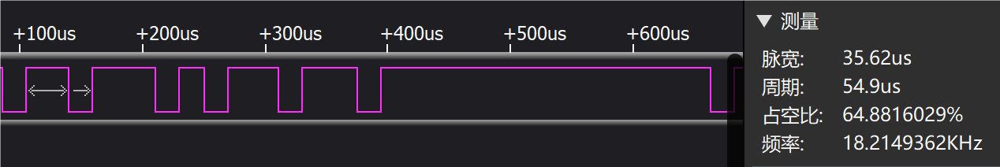

## SENT帧
以下是一个典型的SENT帧，__已知1tick为3us__

## 数据段解析
如上图所示，数据段有6个Nibble; 且已知Nibble的值为12ticks后第一个下降沿对应的tick数，用4bit来表示。__所以假设一个Nibble对应20个tick, 则其对应的值为20-12=8tick，表示为`0b0100`__
#### Nibble_1

tick number = round((19.23+38.75)/3) = 19
nibble number_1 = 19 - 12 = 7 = `0b0111`

#### Nibble_2

tick number = round((19.24+35.68)/3) = 18
nibble number_2 = 18 - 12 = 6 = `0b0110`

#### Nibble_3

tick number = round((19.3+35.62)/3) = 18
nibble number_3 = 18 - 12 = 6 = `0b0110`

#### Nibble_4

tick number = round((19.28+50.89)/3) = 23
nibble number_4 = 23 - 12 = 11 = `0b1011`

#### Nibble_5

tick number = round((19.28+20.38)/3) = 13
nibble number_5 = 13 - 12 = 1 = `0b0001`

#### Nibble_6

tick number = round((19.29+41.76)/3) = 20
nibble number_6 = 20 - 12 = 8 = `0b1000`

## CRC校验
由于这个SENT帧是由`海拉传感器的RS_D端`输出的，因此使用的是`推荐CRC算法`：

> 根据 SENT 标准协议文档，定义了 2 个快速通道 CRC4 计算:
> * 传统算法：在计算 CRC 时，数据末尾不加0，那么要检查 CRC，需要计算 CRC 结果并进行比较。如果相同，则 CRC 是正确的。
> * 推荐算法：在计算 CRC 时，CRC 验证时会将 CRC 纳入计算中。如果最终结果为 0，则表示 CRC 正确，否则报错。

#### CRC段

tick number = round((19.24+44.87)/3) = 21
nibble number_CRC = 21 - 12 = 9 = `0b1001`

#### 推荐CRC算法验证
* Polynomial: 多项式为`x^4 + x^3 + x^2 +1`，对应16进制`0x1D`,对应二进制`0b11101`
* Seed：初始值为`0b0101`
1. 按二进制 __从左到右__ 依次将Seed，Nibble从小到大，CRC按顺序排列成一个二进制数串
2. 将多项式`0b11101`和`最左侧开始第一个1`对齐，并进行异或
3. 重复步骤2
4. 如果最后结果是`0`，那就说明CRC校验成功

__可见，CRC校验成功！__

### CRC计算的代码实现
* 位宽等于多项式二进制个数减1，对于`0b11101`，位宽就是`4`
* 只要涉及uint64位的判断or算法，一定要保持数据宽度一致！！

#### 传统CRC算法
##### 发送方
1. 按二进制 __从左到右__ 依次将Seed，有效数据段Nibble从小到大，按顺序排列成一个二进制数串，__数据末尾不需要补0__
2. 将多项式`0b11101`和`最左侧开始第一个1`对齐，并进行异或
3. 重复步骤2，直到异或的结果有效值小于5位时停止（结果位数小于多项式位数了）
4. 此时最终的异或结果值就是`传统CRC算法`算出的CRC值
5. 发送方将数据和CRC一并发给接收方
##### 接收方
6. 接收方按照步骤1~3，重新计算一遍CRC，并和发送方的CRC进行比对，如果二者相同，说明 __CRC校验成功__

#### 推荐CRC算法
##### 发送方
1. 按二进制 __从左到右__ 依次将Seed，有效数据段Nibble，__4位0__ 从小到大，按顺序排列成一个二进制数串，__补0的位数是多项式位数-1__
2. 将多项式`0b11101`和`最左侧开始第一个1`对齐，并进行异或
3. 重复步骤2，直到异或的结果有效值小于5位时停止（结果位数小于多项式位数了）
4. 此时最终的异或结果值就是`推荐CRC算法`算出的CRC值
5. 发送方将数据和CRC一并发给接收方
##### 接收方
6. 接收方 按二进制 __从左到右__ 依次将Seed，有效数据段Nibble，__发来的CRC__ 从小到大，按顺序排列成一个二进制数串
7. 进行步骤2
8. 重复步骤2，一直算到底，如果最后得到结果是`0`，说明 __CRC校验成功__

> 下图是推荐CRC的 __接收方验证__ 流程：

__详细实现代码：`C:\Users\admin\Desktop\文件\CRC.c`__

## 短串行消息
短串行消息属于`串行消息传输（慢速通道传输）`的一种
* 已以下SENT信号为例，这是共16个SENT帧的消息，每一帧数据段为6个Nibble：
>	6, 50, 5, 19, 5, 22, 5, 18, 5, 15, 5, 8, 5, 17, 5, 12, 5, 15, 5, 12,
	6, 50, 5,  7, 5, 22, 5, 18, 5, 15, 5, 8, 5, 17, 5, 12, 5, 15, 5, 12,
	6, 50, 5,  7, 5, 22, 5, 18, 5, 15, 5, 8, 5, 17, 5, 12, 5, 15, 5, 12,
	6, 50, 5, 11, 5, 22, 5, 18, 5, 15, 5, 8, 5, 17, 5, 12, 5, 15, 5, 12,
	6, 50, 5, 11, 5, 22, 5, 18, 5, 15, 5, 8, 5, 17, 5, 12, 5, 15, 5, 12,
	6, 50, 5, 11, 5, 22, 5, 18, 5, 15, 5, 8, 5, 17, 5, 12, 5, 15, 5, 12,
	6, 50, 5, 11, 5, 22, 5, 18, 5, 15, 5, 8, 5, 17, 5, 12, 5, 15, 5, 12,
	6, 50, 5, 11, 5, 22, 5, 18, 5, 15, 5, 8, 5, 17, 5, 12, 5, 15, 5, 12,
	6, 50, 5, 11, 5, 22, 5, 18, 5, 15, 5, 8, 5, 17, 5, 12, 5, 15, 5, 12,
	6, 50, 5,  7, 5, 22, 5, 18, 5, 15, 5, 8, 5, 17, 5, 12, 5, 15, 5, 12,
	6, 50, 5, 11, 5, 22, 5, 18, 5, 15, 5, 8, 5, 17, 5, 12, 5, 15, 5, 12,
	6, 50, 5,  7, 5, 22, 5, 18, 5, 15, 5, 8, 5, 17, 5, 12, 5, 15, 5, 12,
	6, 50, 5, 11, 5, 22, 5, 18, 5, 15, 5, 8, 5, 17, 5, 12, 5, 15, 5, 12,
	6, 50, 5,  7, 5, 22, 5, 18, 5, 15, 5, 8, 5, 17, 5, 12, 5, 15, 5, 12,
	6, 50, 5,  7, 5, 22, 5, 18, 5, 15, 5, 8, 5, 17, 5, 12, 5, 15, 5, 12,
	6, 50, 5, 11, 5, 22, 5, 18, 5, 15, 5, 8, 5, 17, 5, 12, 5, 15, 5, 12,
* 慢速通道定义：

* 根据定义，短串行消息由16帧连续的无错误SENT消息组成，而DataByte就位于 __第5到12个SENT帧的状态段的bit2按顺序组成__
* >SENT帧的第几个是从1开始，bit几是从0开始
* 将上面的SENT信号的第5~12的状态段全拿出来：
    1. 5，11：5+11-12=0b0100, `bit2=1`
    2. 5，11：5+11-12=0b0100, `bit2=1`
    3. 5，11：5+11-12=0b0100, `bit2=1`
    4. 5，11：5+11-12=0b0100, `bit2=1`
    5. 5，11：5+11-12=0b0100, `bit2=1`
    6. 5，7：5+7-12=0b0000, `bit2=0`
    7. 5，11：5+11-12=0b0100, `bit2=1`
    8. 5，7：5+7-12=0b0000, `bit2=0`
    * 综上短串行消息数据为`0b11111010`=`0xFA`