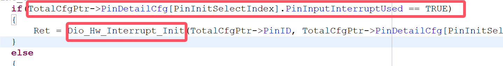

## 问题描述
在使用DIO模块的时候，假设定义了GPIO20为输出；GPIO18为输入，并 __只开启GPIO18的中断使能__。连接GPIO20和18，并在代码不断翻转GPIO20；由于两个GPIO连接在一起，GPIO18也会相应的不断翻转并进入IRQ，但是当打印IRQ的入参`ch`的时候：
第一次打印的时候：0x40000 -->对应只有GPIO18位被置起
之后的打印：0x140000 -->对应GPIO18和GPIO20同时被置起
__问题是只有GPIO18开启了中断，为什么GPIO20的翻转也会体现在IRQ的入参ch中呢__

## 问题解答
1. 首先，通过kingst观察GPIO18和GPIO20的电平情况：

__可见，由于连接在一起，这两个电平的翻转几乎同时发生__

2. 在`Dio_Hw_Irq.c/ISR`中，存在对于中断处理函数的定义：

    * 可见，中断处理函数里的入参`ch`其实就是`IrqNum`，而这个`IrqNum`其实读取的是`UNMASK_INT_STAT`的值，根据芯片手册，这个寄存器里的值是 __未掩码的中断状态位__，这就解释了为什么`ch`的值会包含没有配置中断的通道号。
（同时，从`UNMASK_INT_STAT`寄存器读值之后，又将这个值写入了`INT_CLR`寄存器，根据芯片手册，这会清除中断位）

3. 根据点2，尝试修改ISR函数，将入参改为`MASK_INT_STAT`

此时，输出变成了预期的状态：

>    * 在`Port_Hw.c/Port_Hw_PriSetInPinCfg`中，有以下代码：
    
    相应在`Dio_Hw_Irq.c/Dio_Hw_Interrupt_Init`中，有以下代码：
    
    结合这两个代码片：当在GPIO中设置某一位的中断使能开启时，在底层代码中会取消相应那一位的中断掩码，从而使得这一位能够触发中断，这就解释了虽然GPIO18和20都跳变了，但是只有GPIO18的跳变能够进入中断，因为第18位取消了中断掩码

__综上，只有配置了中断的GPIO18可以触发中断，但由于杜邦线的连接，GPIO18和20会几乎同时跳变，当进入ISR时，会先检查未掩码的中断位，此时GPIO20的高电平也会被读到并保存到入参，随后才会统一的清除中断位__