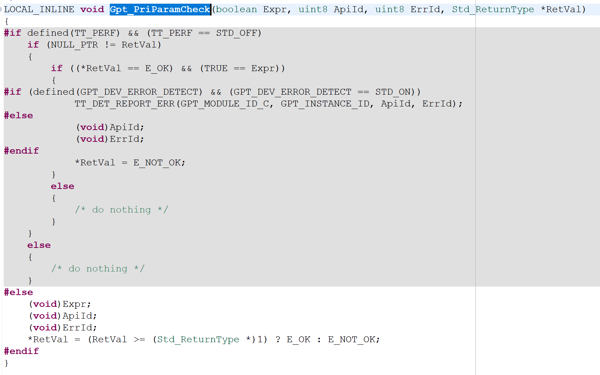
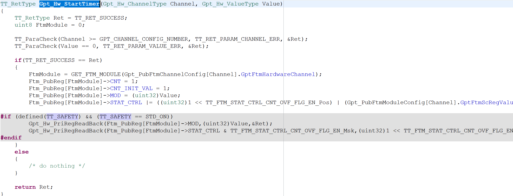
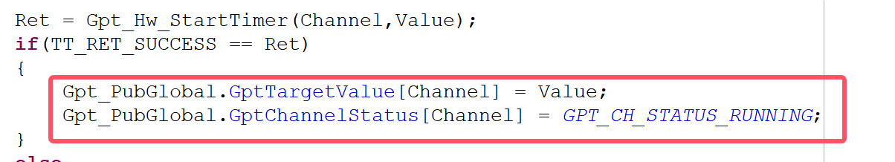
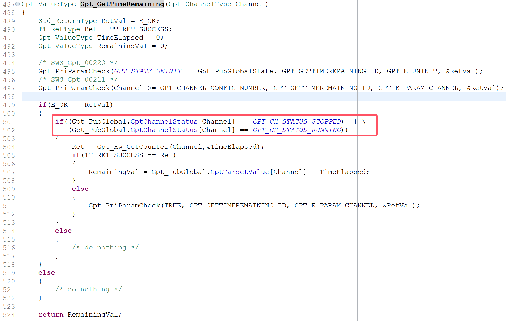
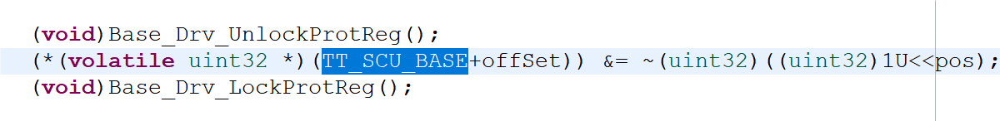
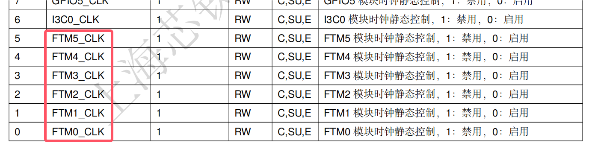

## 问题描述
在GPT模块中，当`TT_SAFETY`和`DEV_ERROR_DETECT`都关闭，只有`TT_PERF`打开时：去初始化后打开GPT0开始计时->延时1ms->读取GPT0剩余计数值，读出的结果是开启计时时设定的目标值。
而当这三个选项是其他组合时，读出的值都是0.

## 分析
1. 在去初始化函数中，会将`GptChannelStatus[Channel]`设置为`GPT_CH_STATUS_UNINITIALIZED`，将`Gpt_PubGlobalState`设置为`GPT_STATE_UNINIT`

2. 在`Gpt_StartTimer`函数中，会尝试先检查`Gpt_PubGlobalState`是否为`GPT_STATE_UNINIT`：
   >`Gpt_PriParamCheck(GPT_STATE_UNINIT == Gpt_PubGlobalState, GPT_STARTTIMER_ID, GPT_E_UNINIT, &RetVal);`
    
    而跳转这个`Gpt_PriParamCheck`：
    
    会发现：当`TT_PERF`打开时，这个函数只会比较`RetVal`是否大于等于1，而由于`RetVal`是一个指针变量，此处没有加上`*`,所以`RetVal`的值代表地址，必定大于1，所以此处虽然`Gpt_PubGlobalState`的确是`GPT_STATE_UNINIT`，但是这个检查的函数会返回E_OK，__也就是说任何paramcheck函数在`TT_PERF`开启时是无效的。__

3. 根据第二点的结论，在去初始化之后，调用`Gpt_StartTimer`函数会成功跳转到`Gpt_Hw_StartTimer`函数，在这里会将目标值写入MOD寄存器：

在写入寄存器之后，如果开启了`TT_SAFETY`，那么会对寄存器进行回读检查，但是现在没有开启，所以返回值依然为正常，跳转回`Gpt_StartTimer`函数，并对返回值检查，发现正常，于是执行以下代码：

可见，将`GptChannelStatus[Channel]`设置为`GPT_CH_STATUS_RUNNING`，且在`Gpt_PubGlobal.GptTargetValue[Channel]`设置了目标计数值

1. 最后，调用`Gpt_GetTimeRemaining`函数尝试获取GPT0剩余计数值，首先由于`TT_PERF`,程序又会畅通无阻的运行到下图红框处：

由于刚刚把`GptChannelStatus[Channel]`设置为`GPT_CH_STATUS_RUNNING`，因此，成功进入了if,跳转到了`Gpt_Hw_GetCounter`函数，获取了cnt计数值并返回作为`TimeElapsed`的值，最后进行如下的运算：

前一个值在第三步的末尾被赋值成了目标值，而后一个值为0，所以结果为目标计数值

__发生这种现象的原因在于：去初始化之后，`Gpt_Hw_DeInit`函数调用了`Mcu_Drv_Misc_LocalResetModules`和`Mcu_Drv_Clk_StopModules`将模块关闭了，此时是无法对寄存器进行写值的，但是由于没有进行寄存器回读，让程序以为成功写值了。`Gpt_PubGlobal.GptTargetValue[Channel]`不是寄存器的值而是程序以为成功并赋值的一个变量；而`TimeElapsed`是真正从寄存器读的值，所以为0；这二者相减自然就是设置的目标值了__

## 模块时钟的开关
根据刚刚的结论可以了解到：在调用INIT/DEINIT来初始化/去初始化GPT模块的时候，底层一个很重要的函数就是`Mcu_Drv_Clk_Stop/StartModules`,在初始化的时候打开时钟；在去初始化的时候关闭时钟。
* 已开启时钟为例，在`Mcu_Drv_Clk_StartModules`函数中，核心的操控语句就是：

这其实本质也是对寄存器的赋值，通过推导，实际操控的寄存器是 __SCU模块的CGU_CLK0_STOP寄存器__

通过对这个模块第0~5位写0，可以开启相应FTM通道的时钟，而GPT就是基于FTM的，所以也会被相应的打开，只有相应的FTM时钟被打开了，对于GPT寄存器的操作才会生效！