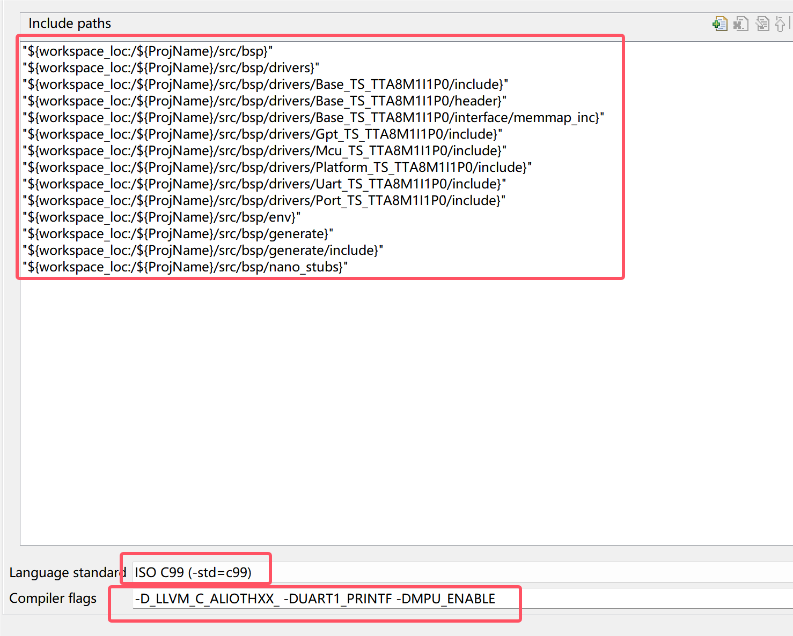

1. `Ctrl+Shift+P`:打开命令面板，输入`C/C++`,找到`C/C++:Edit Configurations(JSON)`
2. 打开TTStudio -> Build Setting -> Compiler，找到相关定义：
    
3. 在VS_Code打开的工程文件夹里，找到`.vscode`->`c_cpp_properties.json`
   * `includePath`中添加`"D:\\tt_workspace\\TT工程名称\\**"`,EB+ `EB工程名称\\**`
   * `defines`中添加`"_LLVM_C_ALIOTHXX_","UART1_PRINTF","MPU_ENABLE"`,EB+ `USING_OS_AUTOSAROS`
     * 注意，在TTStudio里编译选项前会加`-D`，这其实是编译宏，起define的作用；而在VS Code里写编译选项的地方前面已经写了`"defines"`，因此可以把`-D`去掉
     * 同时，前面加了下划线的可能是特定编译器或工具链的惯例，标准编译选项应该没有下划线
   * `cStandard`中改为`c99`
4. 在我的理解中，VS Code这个json文件定义的其实就是linux系统中需要手动敲gcc时后面加的编译选项，这里只不过统一写在json文件中了
