# OVERALL & 零碎知识点
* MCAL放在EB下（AUTOSAR协议）
* bsp包放在TT Studio
    * 使用TT Studio来创建的工程就是bsp工程
    * 配置文件名字带driver，就是bsp的
* Crypto: 用于处理加密（国密）相关的模块；主要提供硬件支持
* HW -- Hard Ware
* 开发板引脚图
  * COB板 -- 会全接口开放引脚图
  * 核心板 -- 现在用的
  * datasheet -- 看引脚复用
* 串口报“HardFault” -- 跑飞了
    * 跑一段时间关闭DEBUG中断，generate一下
* Confluence里有很多软件的经验文档（现在已转为redmine）
* AUTOSAR中，`SRS`代表`软件需求规范`；`SWS`代表`软件规范`（__更详细__）
* `C:\Users\admin\Desktop\mcal_demo\mcal\dio_demo\led-blink\srcA8V2_CORE_DCDC_V1_1`是板子的引脚图，第二页右边最大的应该就是A8，找到目标GPIO看它对应引出来的红色字写了什么，__红色的字就是在板子四周实际打印出来的字__

---

# TT Studio
* __在TT Studio中创建MCAL项目__
    * ~~在gitlab中有一个‘ttspy’工具可以自动化实现在TTStudio的MCAL项目创建; 具体使用方法见`\\192.168.2.6\公司文件\培训库\05_高阶研发类\081_EB软件配置及工程构建\A8工程构建快速入门.mp4 --50分钟`~~
    * ~~用工具生成之后，再import到TTStudio里就OK~~
    * Step0. 安装MCAL包，EB的地址是：`C:\EB\tresos`
    * Step1. 在EB中进行配置，记下EB生成的配置文件output路径
    * Step2. 在TT Studio里创建MCAL工程
        * _plugin_：对应bsp包下的m7\assembly\plugins，比如`D:\ThinkTechStudio\thinktech\bsp\TTA8_V1.1.0\m7\assembly\plugins`
        * _generate code path_： 就是刚刚EB生成的配置文件路径

* TT Studio里的pinmux和EB里的port配置向对应：
  * 在BSP工程中，引用的是`Port_Drv.h`，对应初始化API`Port_Drv_Init(&Port_ConfigData);`
  * 在MCAL工程中，引用的是`Port.h`，对应初始化API`Port_Init(NULL_PTR);`
  
* TTStudio报错的格式为`Module:219,ApiId:100,ErrStatus:0x33`： 
  * Module号码在相应模块的`XXX_Drv.c`中的`Source File Version Information`对应：
  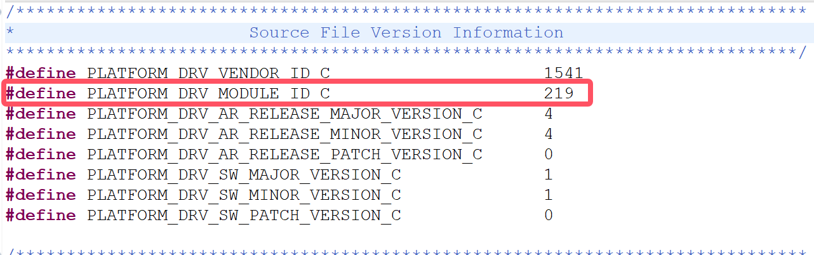
  * 找到对应模块后，ApiId在同一个`XXX_Drv.c`中对应函数的前缀注释里：
  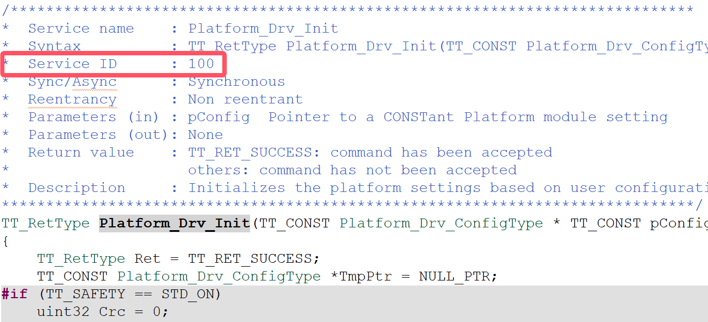
  * 最后的ErrStatus需要查看对应`TT_DrvError.h`中定义的宏
    > 在错误函数里随便找一个 `_ERR` 结尾的变量跳转一下就可以到这个文件里去了
  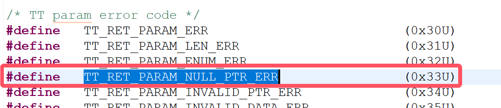

* 在EB配置完成后，在TTStudio里使用API经常不知道应该调用哪个变量，因为config文件是由EB自动生成的，这个时候应该参考以下办法：
  * 首先，EB生成的是一个`output`文件夹，在TT Studio的项目下可以找到这个被链接的同名文件夹。假设模块A，则其对应的配置文件应该出现在:`output/include/A_Cfg.h`和`output/src/A_PBcfg.c`这两个文件下
  * 在这两个文件下找到目标变量：
    * 如果目标不是static，则这一步就结束了，可以直接调用
    * 如果是`static`，则需要右击这个变量选择`Open Call Hierarchy`然后往上跳转，直到找到不是`static`的地方，然后梳理逻辑关系表达出来，最终形如`Dio_GlobalData.Config[0].DioChannelConfigData[1]`

* 在BSP工程中，和EB生成的`ouput`平行的概念就是`bsp/generate`文件夹，同样如果在TTStudio里使用API经常不知道应该调用哪个变量，就从`bsp/generate/include/XXX.h`和`bsp/generate/src/XXX.c`这两个文件下按照上一点的方法来找

* 假设模块A，BSP层的接口一般在`A_Drv.h`，MCAL层的接口一般在`A.h`（gpt例外，它只有`gpt.h`）；一般MCAL层的接口会调用BSP层的接口，相当于一种为了满足AUTOSAR标准的上层封装，这点也可以通过右击API选择`Open Call Hierarchy`来进行验证

# EB
* 在安装完EB的mcal包后，在`C:\EB\tresos\plugins`下可以看到由mcal包自动导入的plugins，每个plugin里面的config文件夹里有一个xdm文件，这个文件使用的xml语言，通过一个个'节点'，'容器'等的定义来实现了EB软件界面的配置菜单：
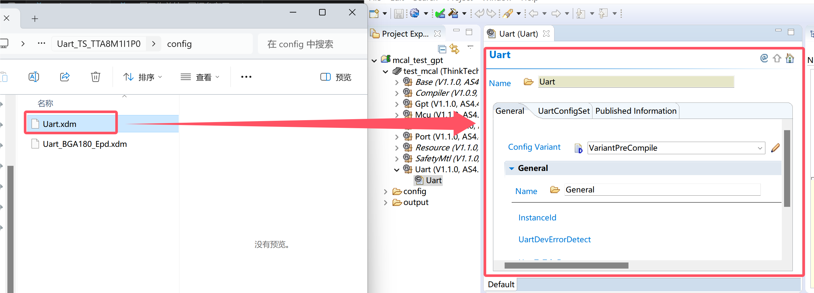
* EB界面的help -> help contents里有很多帮助文件（要学会看官方手册！）
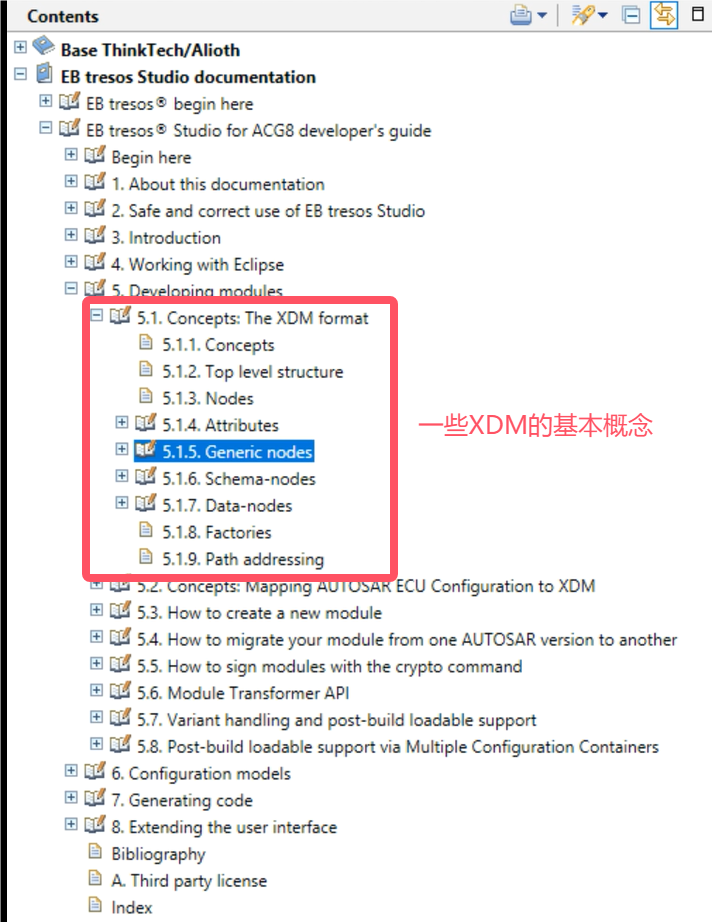
* 每个工程基本都要配置的模块：`Base`；`Mcu`；`Platform`；`Port`(引脚)；`Uart`
* 每个模块都会默认选择`PreCompile`，这种情况下在TTStudio中调用相应初始化API的时候 __传入参数就必须是空指针__；但如果客户想要修改对应结构体的内容，则需要在EB里选择`PostBuild`，然后对应在TTStudio初始化的时候就需要 __传入相应的结构体指针__

---

# 模块学习
A8模块总览：
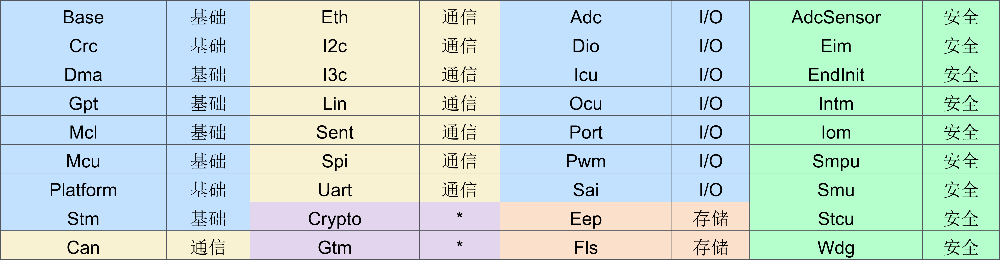

---

__模块的学习参考：这份文档+Xmind+芯片手册+AutoSAR规范__

---

## 基础模块
### Port模块
配置引脚用
* 需要上拉电阻的引脚配成`开漏OD`(比如I2C)；其他配成`推挽PP`
* 引脚可以配置成`IN`；`OUT`；`INOUT`，其中，如果是作`GPIO口`则不允许配置成`INOUT`
* 

### DIO模块
* __DIO的初始化均由Port模块完成__
  * 在port中初始化相应的引脚为DIO
  * 在DIO模块里要再初始化一下，已通过软件代码的参数检查
* Digital Iput Output
* DIO 与 GPIO 区别主要在于是否带隔离，GPIO 不带隔离，DIO 带隔离
* A8芯片一共有五组`端口Port`（ID：0~4），每组有 `32路GPIO（单通道）`
  * __一个bit对应一个通道__
  * 在io_mux里，假设我选择了GPIO 30，那就属于port 0分组
* 可以对`端口`，`单通道`，`通道组`进行读写操作
  * 通道组：一个端口内，连续的通道组合
* 芯钛有外部中断触发的功能（AUTOSAR没有要求）
* 在EB中DIO模块配置的port和channel的名字会共同决定TTStudio里自动生成的config文件里对channel名称的包装
  * 所以在编程时，比如通道30不能直接写30，而是在`Dio_Cfg.h`中找到宏定义，类似`DioPort_0_DioChannel_x`的名字
  * 根据实践，也可以通过跳转然后用这个表达式`Dio_GlobalData.Config[0].DioChannelConfigData[x]`
* 对‘配置为输入的GPIO’进行channel write没用，也没有意义
* DIO配置Channel Group:
  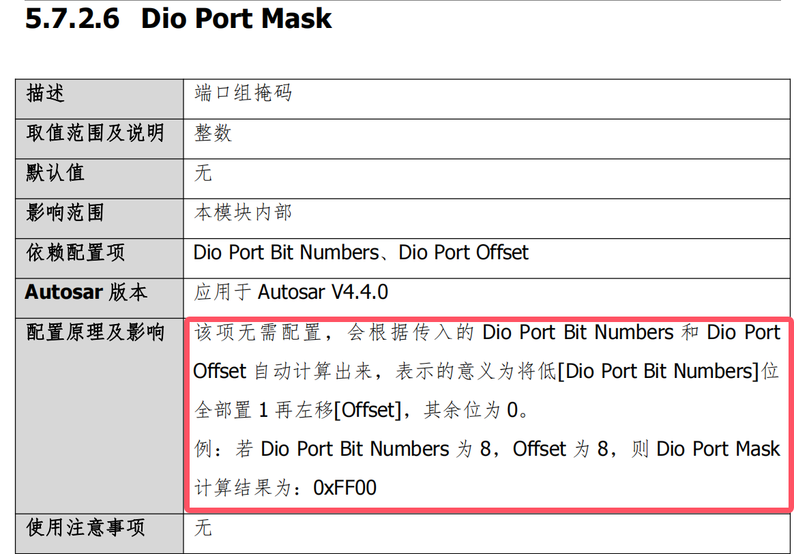
  * 同样的，在TTStudio中，channel group的表示也需要找到程序定义的那个结构体：`Dio_GlobalData.Config[1].DioChannelGroupConfigData`
* DIO可以配置中断，但是 __同一个端口内的通道只能共用一个中断__。开启中断后，同样需要配置对应的port和platform
  * platform模块中，GPIOA -> DIO的GPIO0 -> 端口0的中断
  * 端口的中断处理函数IRQ会有一个参数ch，假设是通道19触发了中断，那么这个ch的值就是`0000 0000 0000 1000 0000 0000 0000 0000`，对应10进制的`524288`，__如果中断处理函数调用期间另两个属于该端口的通道触发了中断，那他们会等当前中断结束后，按顺序再依次进入IRQ__

### GPT模块
* FTM的一个子模块，是一个16位的计数器

* general purpose timer 通用定时器

* __notification通知__和__唤醒__都会产生中断，且都是在当计数器数到`target time`的时候，而`target time`就是在调用`Gpt_StartTimer`函数时输入的第二个参数
  * __notification 中断__：*这种中断用于在定时器达到目标时间时调用一个特定的通知函数。这个通知函数可以执行各种用户定义的操作，如处理定时事件、更新系统状态等。*
  * __wakeup 中断__：*只能在`sleep mode`下才能生效！！这种中断用于在ECU（电子控制单元）处于低功耗模式时，当定时器达到目标时间时唤醒ECU。这个功能常用于在低功耗模式下需要定时唤醒系统执行某些任务。*

* 在AUTOSAR规范下，有一个叫做Predef Timer(预定义定时器)的概念：
  * AUTOSAR规定的预定时器种类：
    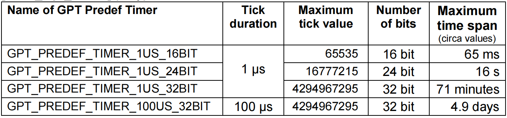
    * *AUTOSAT希望能够尽可能的实现以上所有的预定时器，以确保所有平台的基于时间的功能兼容性*
  
  * AUTOSAR 建议每个时间刻度使用一个硬件定时器，并通过选择合适的时钟和预分频器将硬件定时器直接与时钟源 "fclock = 1 / (时间刻度)" 连接。这样，可以直接使用定时器计数寄存器的值，而无需进行任何适配（计算），以提高性能
    * *比如，如果GPT使用了`FTM_CLOCK_SOURCE_SYSTEMCLK`作为时钟源，那么频率是120Mhz，那么如果我想实现1us的时间刻度，我应该选择120分频（__1微秒的时间间隔对应于1 MHz的频率__）*
  
  * 已知GPT是16位的，所以硬件上并不能实现24和32bit的预定时器，这个时候可以使用软件的方法来模拟更高位数的计时器（但这会带来一些复杂性和额外的计算开销）
     * *可以参考的办法：*
    > *__异步级联定时器作为预分频器__
    > 使用一个定时器作为另一个定时器的预分频器，这样可以通过第一个定时器降低时钟频率，从而扩展第二个定时器的范围
    >__同步级联定时器扩展定时器范围（位数）__
    > 将多个定时器同步级联，以扩展定时器的位数范围。例如，将两个16位定时器同步级联，可以扩展到32位*

  * 如果启用了一个GPT预定义定时器，那么所有具有相同时间刻度但位数更低的定时器也应被启用。
    * 比如我启用了1us 32位的预定时器，我就也必须开启1us 16位和24位的定时器

## 通信接口
### SENT模块
* __Single Edge Nibble Transmission 单边半字传输协议__
* SENT协议是一种和CAN,LIN并列的概念,但比CAN,LIN更加经济可靠，无需接收器/集成发射器
* 供电一般是5V
* __用于接收传感器信号__，由于只接收不发送，所以叫'单边'，所以需要的数据线很少，加上电源和地线只需要三根线
* SENT协议使用的时间基准：1 tick
  * 1 tick的设置范围：0.2~90us
  * 12-27个tick为一组，名为`Nibble`，1个`Nibble`必须在[12,27]个ticks之间，Nibble的值由两个下降沿的时间差来决定，第一个下降沿在tick0就发生了，且在12个tick之内会上升，所以12tick之后遇到的第一个下降沿对应多少tick，Nibble的值就是多少。所以 __Nibble的值在0到15之间，对应二进制0000~1111__，4个bit对应0.5Byte,__这就是‘半字’的由来__
* A8支持三种CRC算法：传统CRC；推荐CRC；AlterCRC。且都可以选择‘带状态的CRC’
* 

##### 帧结构
* SENT信号帧结构
  * `同步段` --- __固定56ticks__ 由于传感器和ECU的时钟频率不一样，所以需要同步段进行校准
  * `状态/通讯段` --- __12~27 ticks__，用于传输串行消息/传感器错误信息
  * `数据段` --- __1~8 Nibbles__, 
  * `校验段` --- __12~27 ticks__，CRC校验，通过数据段反算得出
  * （`暂停脉冲段`） --- 可选，__12~768 ticks__，用于保证SENT帧长度一致
  
##### 模块功能
* __串行消息传输__：按照上述帧结构，一帧一帧连续传就叫 __快速通道传输__；而如果将多个帧的内容组合在一起形成一段消息，就叫 __慢速通道传输__ （重要信号走快速，非关键信号走慢速）
  *  __慢速通道传输__ 又叫 __串行消息传输__，串行消息传输又有 __短串行消息__ 和 __增强串行消息__ 两种模式：
     *  __短串行消息__：
    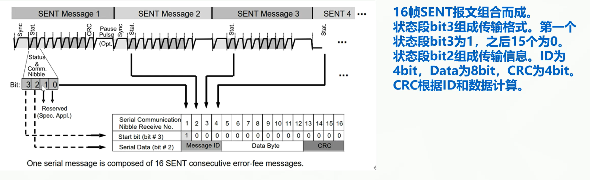
     *  __增强串行消息__：
    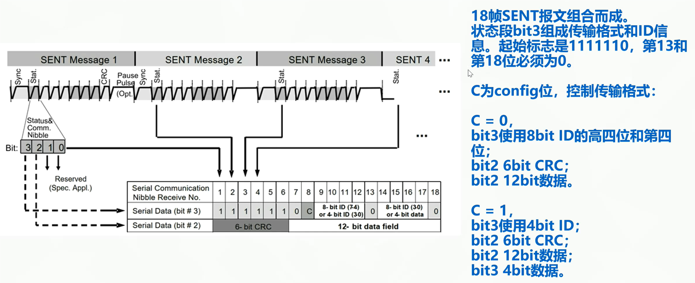

* __校准脉冲检测__：这是一个在EB上可以开关的选项。刚刚提到的`同步段`固定为56个ticks，但实际中允许一定的偏差（25%），而校准这个ticks数量的算法就是校准脉冲算法，其中包括 __连续校准脉冲推荐算法__ 和 __连续校准脉冲备选算法__：
  * __连续校准脉冲推荐算法__：（默认，可以检测出更多的nibble，但耗时更长）
  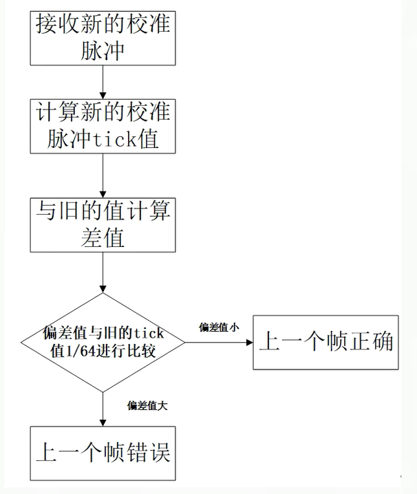
  * __连续校准脉冲备选算法__：
  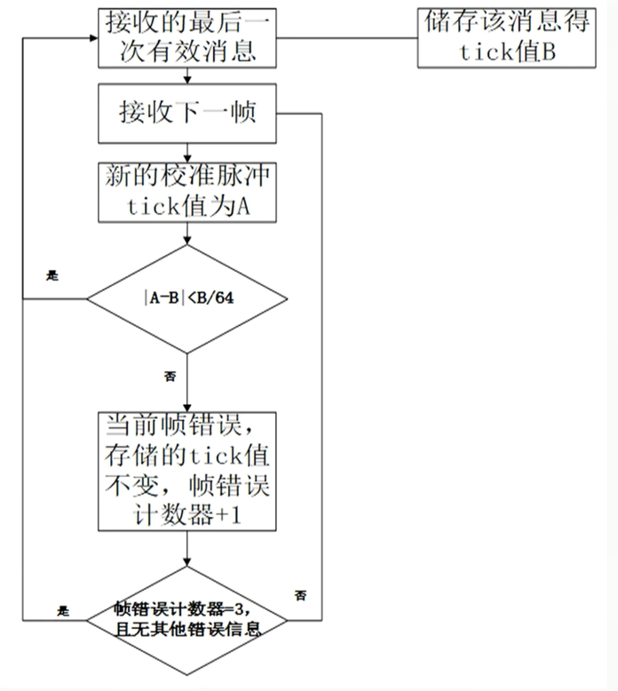

*  __数据位置摆放__：`sent_data_ctrl`控制`sent_frame_data`的数据摆放顺序 
* __SPC协议__：Short PWM Code，本质上是ECU和传感器之间的握手协议，形式是一个低电平脉冲
* __时间戳__：`经历时间 =（tdiv+1）/ sent时钟频率*cts`, tdiv可配，时钟频率通常是120MHz，cts值可以通过接口获取
* __数据FIFO__：32位宽，深度为8的先进先出结构；支持满状态显示和空状态读取报警
* __看门狗__：时基为tick，本质是一个可以设置目标值的计数器，当接收完一个SENT帧后计数到达上限则报警；反之当帧数据接收完毕/寄存器写0时可以清0
* __数字滤波电路__：`想要滤去的最大毛刺时间 = （1/sent时钟频率）* 控制寄存器要设置的值`，时钟频率通常是120MHz，控制寄存器值范围0~511

##### 错误检测
* SENT中有很多种错误，当发生一个错误时，会置起`中断状态寄存器`中相应的位
  
  

### ICU模块
